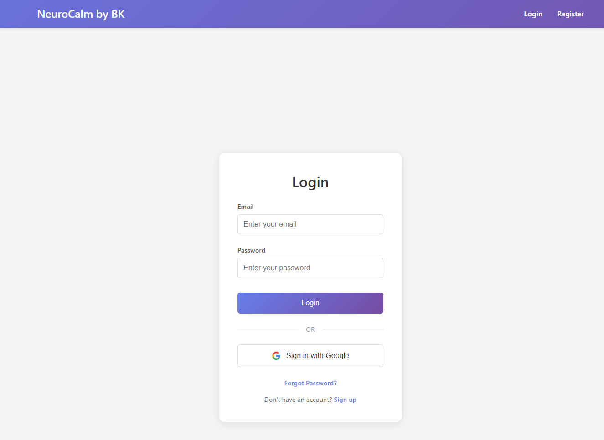
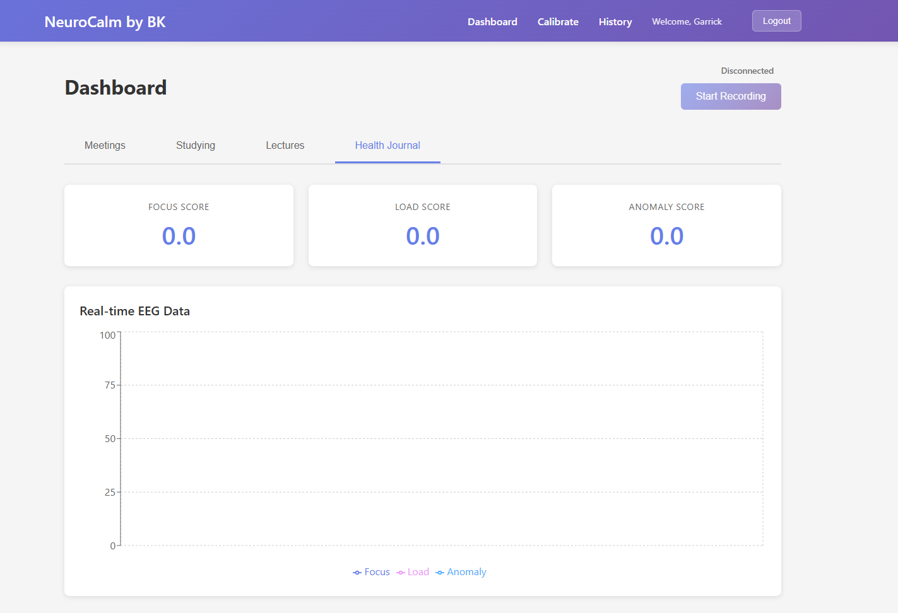
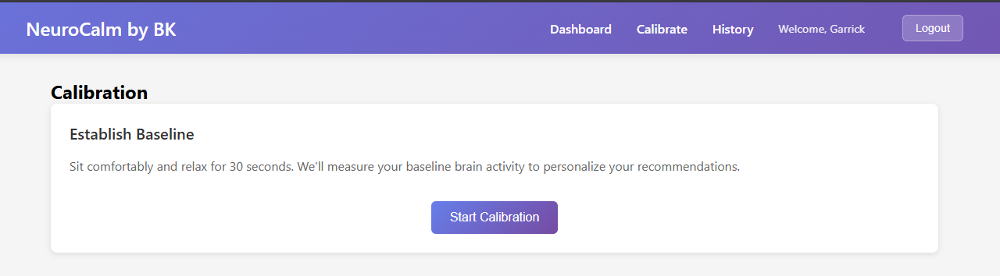
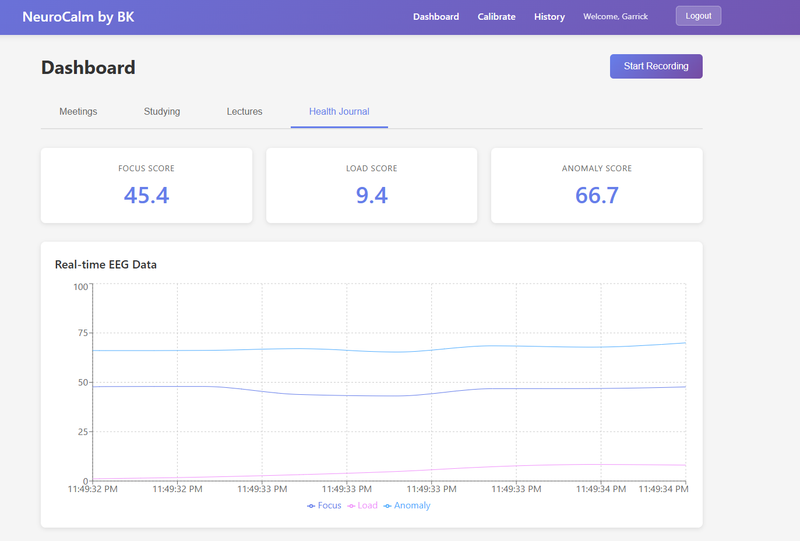

# NeuroCalm

EEG-based relaxation recommendation system using OpenBCI hardware.

## Team

- IFDES - Ali Zain Malik
- cire005 - Eric Mo
- fahadalsalam - Fahad Al-Salam
- Ahyan06 - Ahyan Amin
- Garr-AI - Garrick Tse

## Overview

NeuroCalm is a web application that uses EEG data from OpenBCI to measure brain activity and recommend personalized relaxation techniques. The system collects EEG consistently and using reinforcement learning adapts and provides suggestions for relaxation, tailoring calming methods to the user's needs.
## Architecture

- **Local EEG Service (Python)**: Reads from OpenBCI using BrainFlow, calculates band powers, and streams via WebSocket
- **Browser Extension**: Sends active-tab and calendar context (to be implemented)
- **Web Dashboard (React)**: Shows 4 tabs with real-time EEG visualization
- **Database (SQLite)**: Stores events with timestamp, mode, scores, and context

## Setup Instructions

### Prerequisites

- Python 3.8+
- Node.js 16+ and npm
- OpenBCI hardware (or use synthetic board for testing)

### Backend Setup

1. **Create and activate virtual environment:**
   ```bash
   python3 -m venv venv
   source venv/bin/activate  # On Windows: venv\Scripts\activate
   ```

2. **Install Python dependencies:**
   ```bash
   pip install -r requirements.txt
   ```

3. **Initialize the database:**
   The database will be automatically created on first run.

4. **Start the backend services:**
   ```bash
   # Option 1: Run both API and WebSocket together
   python backend/main.py
   
   # Option 2: Run separately
   # Terminal 1: FastAPI server
   uvicorn backend.api:app --reload --port 8000
   
   # Terminal 2: WebSocket server
   python backend/websocket_server.py
   ```

### Frontend Setup

1. **Install Node.js dependencies:**
   ```bash
   cd frontend
   npm install
   ```

2. **Start the React development server:**
   ```bash
   npm start
   ```

   The app will open at `http://localhost:3000`

### OpenBCI Configuration

By default, the system uses a synthetic board for testing. To use real OpenBCI hardware:

1. **For Cyton Board:**
   ```python
   # In backend/eeg_service.py
   board_id = BoardIds.CYTON_BOARD
   ```

2. **For Ganglion Board:**
   ```python
   # In backend/eeg_service.py
   board_id = BoardIds.GANGLION_BOARD
   ```

3. **Set serial port:**
   ```python
   eeg_service.connect(serial_port="/dev/ttyUSB0")  # Adjust for your system
   ```

## Usage

1. **Calibrate**: Go to the Calibrate page to establish your baseline EEG readings
2. **Start Recording**: Click "Start Recording" on the Dashboard
3. **Switch Modes**: Use the tabs (Meetings, Studying, Lectures, Health Journal) to track different activities
4. **View History**: Check the History page to see past sessions and scores

## Data Model

Events are stored with the following schema:
```json
{
  "timestamp": "2024-01-01T12:00:00",
  "mode": "meeting|study|lecture|background",
  "focus_score": 0-100,
  "load_score": 0-100,
  "anomaly_score": 0-100,
  "context": {
    "tab": "string",
    "url": "string",
    "calendar_event_id": "string"
  },
  "user_id": "string"
}
```

## API Endpoints

- `GET /` - API info
- `POST /events` - Create a new event
- `GET /events` - Get events (supports `user_id`, `mode`, `limit` query params)
- `GET /events/{event_id}` - Get specific event
- `GET /users` - Get list of users
- `GET /stats/{user_id}` - Get user statistics

## WebSocket API

Connect to `ws://localhost:8765`:

**Send:**
- `{"type": "start_recording"}` - Start EEG streaming
- `{"type": "stop_recording"}` - Stop EEG streaming
- `{"type": "set_mode", "mode": "meeting"}` - Set current mode
- `{"type": "set_context", "context": {...}}` - Set context
- `{"type": "set_user", "user_id": "user1"}` - Set current user

**Receive:**
- `{"type": "eeg_data", "data": {...}, "mode": "...", "timestamp": "..."}` - Real-time EEG data
- `{"type": "recording_started"}` - Recording started
- `{"type": "recording_stopped"}` - Recording stopped
- `{"type": "mode_changed", "mode": "..."}` - Mode changed

## Future Enhancements

- Browser extension for automatic context detection
- Calendar integration
- Machine learning for personalized recommendations
- Export data for research purposes
- Multi-user support with authentication







## License

See LICENSE file for details.
